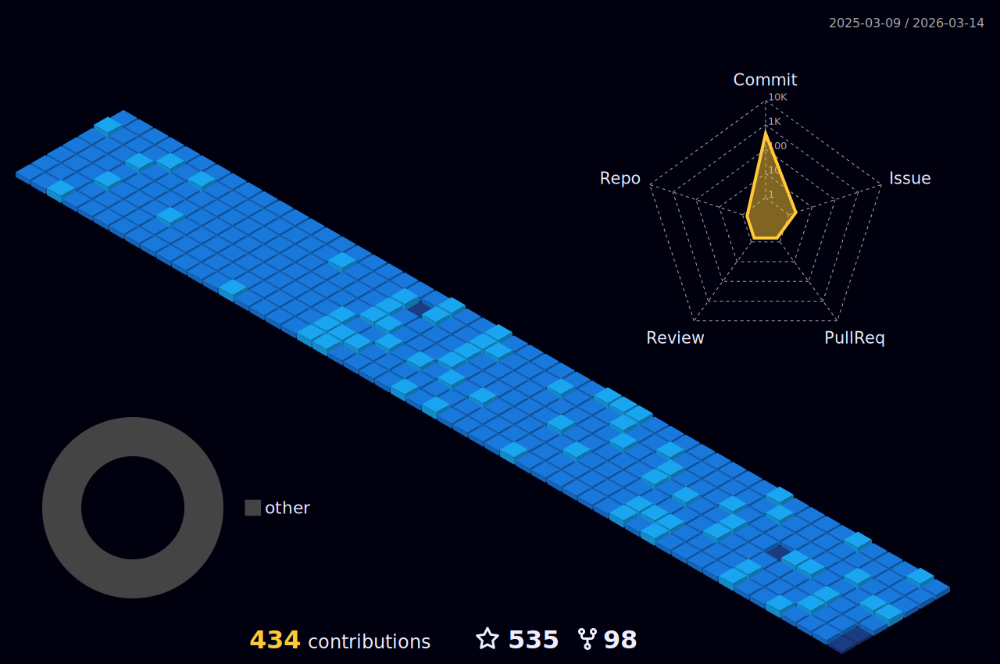

#  🙋 Hello
 

  

  

<table><tr><td valign="top" width="50%">
   

 ### 🤺 About Me

  - ***🔭 我是海洋，目前在北京奇虎360工作*** 
  - ***🌱 从事搜索引擎、AIGC应用相关工作***
  - ***🌱 喜欢编程、打游戏、和健身***
  - ***👯 常年混迹于Github、V2EX、阮一峰周刊等同性交友网站***
  - ***💬 希望能和更多优秀的朋友一起创造出更多优秀的产品***

</td><td valign="top" width="50%">

   

  
</td></tr></table>  

<table>
  <tr><td valign="top" width="2500">

### 🏢 Work Experience

- [奇虎360](https://www.360.cn/) &emsp; 📌 2021-10 —— 至今

  - 工作岗位：后端开发
  - 工作内容：AIGC & 搜索引擎

- [字节跳动](https://www.bytedance.com/) &emsp; 📌 2019-08 —— 2021-10

  - 工作岗位：软件开发
  - 工作内容：Android & 搜索系统 & 数据分析

- [瞬联科技](https://www.nio.cn/) &emsp; 📌 2017-07 —— 2019.08

  - 工作岗位：软件开发
  - 工作内容：Android APP & Android Framework & Android BSP
 

 
- [中科创达](https://www.nio.cn/) &emsp; 📌 2016-07 —— 2017.07

  - 工作岗位：软件开发
  - 工作内容：Android APP & Android Framework

</td></tr>
</table>

<table>
 <tr><td valign="top" width="2500">
  
### 📃 Recent Blog

  <!-- BLOG-POST-LIST:START -->
- 🦣 [C++：重载运算符 - hiyoung](https://www.cnblogs.com/hiyoung/p/17003416.html)  2022-12-24  

- 🫶 [C++：构造函数与拷贝控制 - hiyoung](https://www.cnblogs.com/hiyoung/p/16978252.html)  2022-12-23  

- 🎬 [信息熵相关知识总结 - hiyoung](https://www.cnblogs.com/hiyoung/p/10139185.html)  2018-12-18  

- 🫣 [最强NLP模型-BERT - hiyoung](https://www.cnblogs.com/hiyoung/p/10132560.html)  2018-12-17  

- 🙉 [问答系统总结 - hiyoung](https://www.cnblogs.com/hiyoung/p/10000415.html)  2018-11-22  

- 💪 [检索问答模型 - hiyoung](https://www.cnblogs.com/hiyoung/p/9935852.html)  2018-11-09  

- ⛽️ [文本分类-TextCNN - hiyoung](https://www.cnblogs.com/hiyoung/p/9933230.html)  2018-11-09  

- 🎬 [机器学习-Logistic回归 - hiyoung](https://www.cnblogs.com/hiyoung/p/9866542.html)  2018-10-28  

- 🌜 [Attention注意力机制介绍 - hiyoung](https://www.cnblogs.com/hiyoung/p/9860561.html)  2018-10-27  

- 🦅 [机器学习-聚类Clustering - hiyoung](https://www.cnblogs.com/hiyoung/p/9821589.html)  2018-10-20  
<!-- BLOG-POST-LIST:END -->

 </td></tr>
</table>

<table>
 <tr><td valign="top" width="2500">
  
  ### 📊Github Stats
  

  
  
  

  

 
 

  

 </td></tr>
</table>

<table>
  <tr>
    <td>
      <picture>
        <source media="(prefers-color-scheme: dark)" srcset="https://github-readme-activity-graph.vercel.app/graph?username=hiyoung123&theme=xcode&bg_color=FF000000&hide_border=true" />
        <source media="(prefers-color-scheme: light)" srcset="https://github-readme-activity-graph.vercel.app/graph?username=hiyoung123&theme=xcode&bg_color=FF000000&color=000000&hide_border=true" />
        
      </picture>
  </tr>
</table>

<!--ACTION_START_FLAG:github-followers-->
<table>
  <tr>
    <td align="center">
        
         
        <a href="https://github.com/standardgalactic">Cogito Ergo Sum</a>
    </td>
    <td align="center">
        
         
        <a href="https://github.com/OfficialCodeVoyage">Pavlo Bondarenko</a>
    </td>
    <td align="center">
        
         
        <a href="https://github.com/IDouble">Alp ₿📈🚀🌕</a>
    </td>
    <td align="center">
        
         
        <a href="https://github.com/nholuongut">Nho Luong</a>
    </td>
    <td align="center">
        
         
        <a href="https://github.com/esin">Andrey Esin</a>
    </td>
    <td align="center">
        
         
        <a href="https://github.com/JCSIVO">JCSIVO</a>
    </td>
    <td align="center">
        
         
        <a href="https://github.com/jelspace">21world</a>
    </td>
  </tr>
  <tr>
    <td align="center">
        
         
        <a href="https://github.com/dirambora">Diram</a>
    </td>
    <td align="center">
        
         
        <a href="https://github.com/ArefMq">Aref Mehr</a>
    </td>
    <td align="center">
        
         
        <a href="https://github.com/Akshar-code">Akshar Kottuvada</a>
    </td>
    <td align="center">
        
         
        <a href="https://github.com/removeif">辣椒の酱</a>
    </td>
    <td align="center">
        
         
        <a href="https://github.com/MdRashid62">Muhammad Rashid</a>
    </td>
    <td align="center">
        
         
        <a href="https://github.com/rangola">Goran</a>
    </td>
    <td align="center">
        
         
        <a href="https://github.com/alei76">alei76</a>
    </td>
  </tr>
  <tr>
    <td align="center">
        
         
        <a href="https://github.com/baifengbai">Bai Feng</a>
    </td>
    <td align="center">
        
         
        <a href="https://github.com/Kairatzh">kirtzh</a>
    </td>
    <td align="center">
        
         
        <a href="https://github.com/subhobrata">subhobrata</a>
    </td>
    <td align="center">
        
         
        <a href="https://github.com/northeast250">northeast250</a>
    </td>
    <td align="center">
        
         
        <a href="https://github.com/zhaocc1106">zhaochaochao</a>
    </td>
    <td align="center">
        
         
        <a href="https://github.com/MadhawaRathnayaka">Madhawa Lakshan</a>
    </td>
    <td align="center">
        
         
        <a href="https://github.com/BarryZM">BarryZM</a>
    </td>
  </tr>
</table>
<!--ACTION_END_FLAG:github-followers-->
